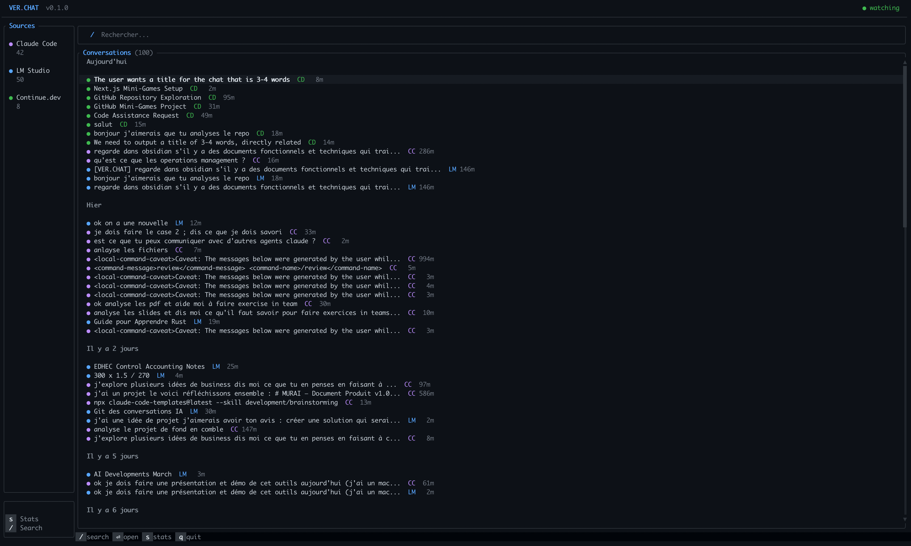

# VER.CHAT

**The Git for AI conversations.** Import, search, and launch your AI conversations across all your tools — from one terminal.

```
$ verchat
```

  



## What it does

You use Claude Code, Cursor, LM Studio, Continue.dev, Gemini CLI... each stores conversations in its own silo. VER.CHAT brings them all together.

- **Import** conversations from 7 AI tools
- **Search** across everything with full-text search
- **Launch** a conversation into another tool — with smart compression to fit any context window
- **Watch** for new conversations in real-time
- **Track** token usage (input, cache write, cache read, output) per conversation

## Install (macOS)

### Homebrew (recommended)

```bash
brew tap zach0028/tap
brew install --HEAD verchat
```

### From source (requires Rust)

```bash
cargo install --git https://github.com/zach0028/verchat-.git
```

### Upgrade

```bash
brew upgrade --fetch-HEAD verchat
# or
cargo install --git https://github.com/zach0028/verchat-.git
```

## Usage

```bash
verchat              # Launch interactive TUI
verchat init         # Detect AI tools and create config
verchat import --auto # Import all conversations
verchat search "auth" # Search across all tools
verchat log          # List recent conversations
verchat copy <id>    # Copy conversation to clipboard
verchat source list  # Show configured sources
verchat source add <tool> <path>  # Add a custom path
```

### TUI Shortcuts

| Key | Action |
|-----|--------|
| `/` | Search |
| `⏎` | Open conversation |
| `c` | Copy to clipboard (Markdown) |
| `l` | Launch in another tool |
| `a` | Add a source path |
| `s` | Stats |
| `↑↓` or `j/k` | Navigate |
| Scroll wheel | Navigate / scroll |
| `q` | Quit |

### Smart Launch

When launching a conversation into another tool, VER.CHAT:

1. Analyzes the conversation (dialogue tokens vs noise)
2. Asks for your target context window (presets: 8K to 1M)
3. Compresses if needed (keeps beginning + end, removes middle)
4. Injects natively or copies to clipboard
5. Opens the target tool — conversation appears at the top of the list

## Supported tools

| Tool | Import | Launch |
|------|--------|--------|
| Claude Code | ✅ JSONL | Clipboard |
| LM Studio | ✅ JSON | ✅ Native inject |
| Continue.dev | ✅ JSON | ✅ Native inject |
| OpenCode | ✅ SQLite | ✅ Native inject |
| Gemini CLI | ✅ JSON | Clipboard |
| Cursor | ✅ Protobuf | Clipboard |
| Aider | ✅ Markdown | Clipboard |

## How it works

```
Claude Code  ──┐
LM Studio    ──┤
Continue.dev ──┤
Gemini CLI   ──┼──► SQLite (local) ──► TUI / CLI
OpenCode     ──┤
Cursor       ──┤
Aider        ──┘
```

All data stays on your machine. No cloud, no account, no network.

## License

Apache 2.0
